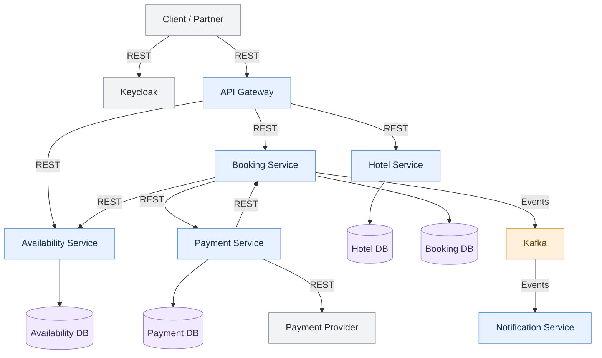

# Архитектура системы

```mermaid
flowchart TB
    Client["Client / Partner"]
    Keycloak["Keycloak"]
    Gateway["API Gateway"]

    HotelService["Hotel Service"]
    AvailabilityService["Availability Service"]
    BookingService["Booking Service"]
    PaymentService["Payment Service"]
    NotificationService["Notification Service"]

    HotelDB[("Hotel DB")]
    AvailabilityDB[("Availability DB")]
    BookingDB[("Booking DB")]
    PaymentDB[("Payment DB")]

    PaymentProvider["Payment Provider"]
    Kafka["Kafka"]

    Client -->|"REST"| Keycloak
    Client -->|"REST"| Gateway

    Gateway -->|"REST"| HotelService
    Gateway -->|"REST"| BookingService
    Gateway -->|"REST"| AvailabilityService

    HotelService --> HotelDB
    AvailabilityService --> AvailabilityDB
    BookingService --> BookingDB
    PaymentService --> PaymentDB

    BookingService -->|"REST"| AvailabilityService
    BookingService -->|"REST"| PaymentService
    PaymentService -->|"REST"| PaymentProvider
    PaymentService -->|"REST"| BookingService

    BookingService -->|"Events"| Kafka
    Kafka -->|"Events"| NotificationService

    classDef service fill:#E8F1FF,stroke:#6395D0,color:#172B4D
    classDef database fill:#F1EAFF,stroke:#9878C4,color:#34254B
    classDef external fill:#F1F3F5,stroke:#929BA7,color:#24292F
    classDef event fill:#FFF0DC,stroke:#DDA34A,color:#66420C

    class Gateway,HotelService,AvailabilityService,BookingService,PaymentService,NotificationService service
    class HotelDB,AvailabilityDB,BookingDB,PaymentDB database
    class Client,Keycloak,PaymentProvider external
    class Kafka event
```