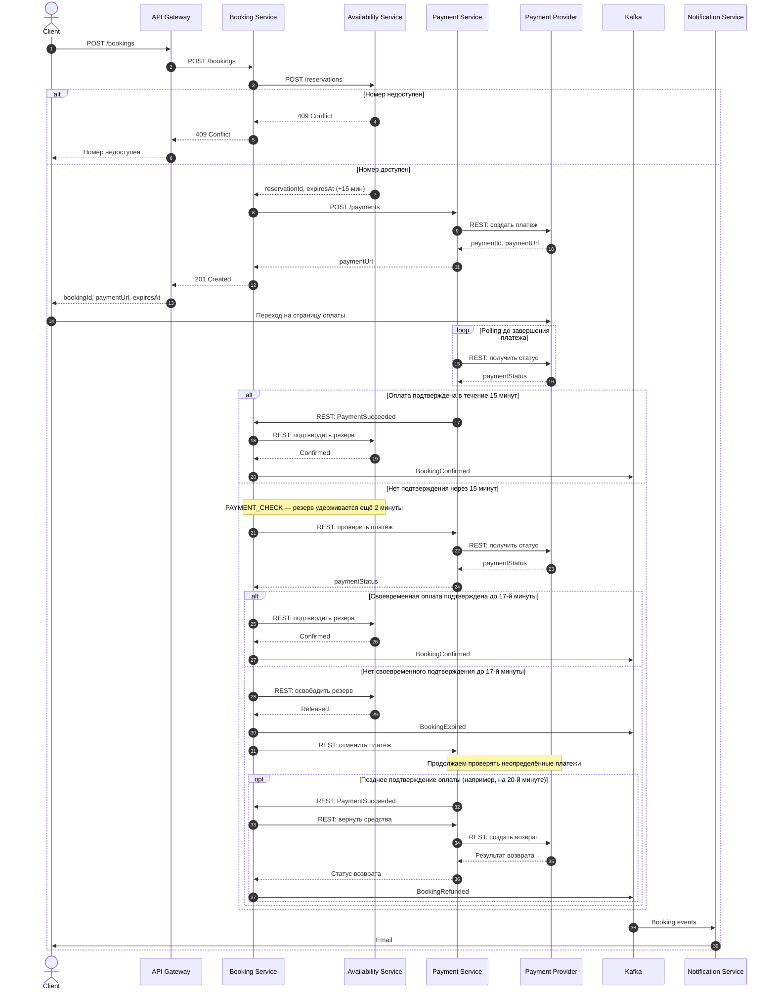

# Архитектура системы

```mermaid
sequenceDiagram
    autonumber
    actor Client
    participant Gateway as API Gateway
    participant Booking as Booking Service
    participant Availability as Availability Service
    participant Payment as Payment Service
    participant Provider as Payment Provider
    participant Kafka
    participant Notification as Notification Service

    Client->>Gateway: POST /bookings
    Gateway->>Booking: POST /bookings
    Booking->>Availability: POST /reservations

    alt Номер недоступен
        Availability-->>Booking: 409 Conflict
        Booking-->>Gateway: 409 Conflict
        Gateway-->>Client: Номер недоступен
    else Номер доступен
        Availability-->>Booking: reservationId, expiresAt (+15 мин)

        Booking->>Payment: POST /payments
        Payment->>Provider: REST: создать платёж
        Provider-->>Payment: paymentId, paymentUrl
        Payment-->>Booking: paymentUrl

        Booking-->>Gateway: 201 Created
        Gateway-->>Client: bookingId, paymentUrl, expiresAt

        Client->>Provider: Переход на страницу оплаты

        loop Polling до завершения платежа
            Payment->>Provider: REST: получить статус
            Provider-->>Payment: paymentStatus
        end

        alt Оплата подтверждена в течение 15 минут
            Payment->>Booking: REST: PaymentSucceeded
            Booking->>Availability: REST: подтвердить резерв
            Availability-->>Booking: Confirmed
            Booking->>Kafka: BookingConfirmed
        else Нет подтверждения через 15 минут
            Note over Booking,Availability: PAYMENT_CHECK — резерв удерживается ещё 2 минуты

            Booking->>Payment: REST: проверить платёж
            Payment->>Provider: REST: получить статус
            Provider-->>Payment: paymentStatus
            Payment-->>Booking: paymentStatus

            alt Своевременная оплата подтверждена до 17-й минуты
                Booking->>Availability: REST: подтвердить резерв
                Availability-->>Booking: Confirmed
                Booking->>Kafka: BookingConfirmed
            else Нет своевременного подтверждения до 17-й минуты
                Booking->>Availability: REST: освободить резерв
                Availability-->>Booking: Released
                Booking->>Kafka: BookingExpired
                Booking->>Payment: REST: отменить платёж

                Note over Payment,Provider: Продолжаем проверять неопределённые платежи

                opt Позднее подтверждение оплаты (например, на 20-й минуте)
                    Payment->>Booking: REST: PaymentSucceeded
                    Booking->>Payment: REST: вернуть средства
                    Payment->>Provider: REST: создать возврат
                    Provider-->>Payment: Результат возврата
                    Payment-->>Booking: Статус возврата
                    Booking->>Kafka: BookingRefunded
                end
            end
        end

        Kafka->>Notification: Booking events
        Notification->>Client: Email
    end
```